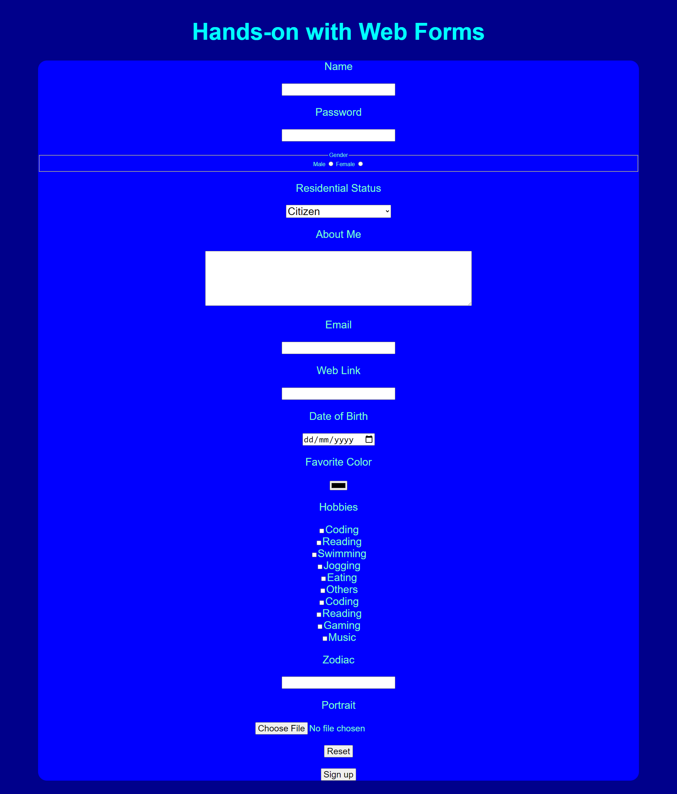
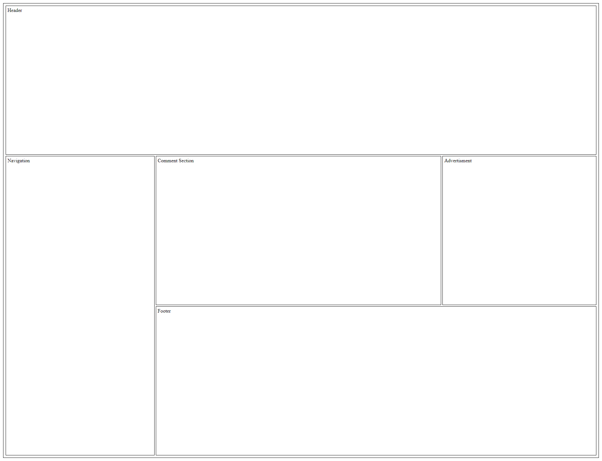

# Front End Web Development
### This is a collection of my Front End Web Development coursework where I learnt to identify user needs and build responsive html components which will eventually be used to create a website.

    
    
    

## Technologies Used
* **HTML**: The standard markup language for creating web pages
* **CSS**: The standard language to style and create responsive web pages

## Some snapshots of my learning process
### Learning the different HTML Typography

### Learning about HTML Lists

### Learning about HTML Semantic Elements and Table

### Learning about HTML Web Forms

### Learning custom assets like fonts and images

### Learning CSS class selectors, order, linking external stylesheet, ID selectors, inline and internal CSS

### Creating a navbar to link multiple pages together

### Linking Javascript to write cooler functions

### Using Javascript to perform form validation

### Creating the basic layout for a website

### Putting everything together!

   
  <h1 align="center">Hi There! I'm Joshua! &#128075;</h1>
    

      
  

  
Thank you for taking the time to look through my project! I hope you enjoyed it as much as I did during the development of this project!

  
Feel free to contact me to discuss any issues, questions or comments.

